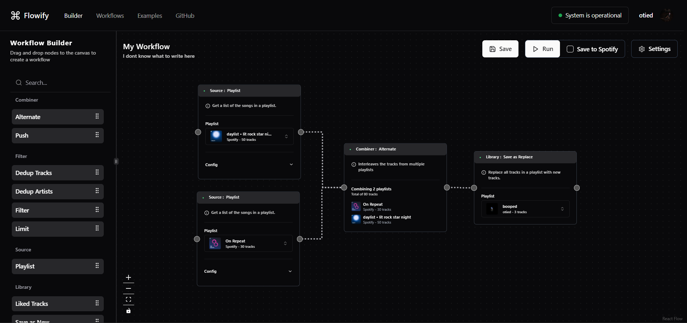

# Flowify✨

## Overview

Flowify is a powerful workflow builder designed to simplify complex Spotify playlist generation. By Using [React Flow](https://reactflow.dev/) as the workflow builder, [bull-mq](https://github.com/taskforcesh/bullmq) for queuing, [shadcn/ui](https://ui.shadcn.com/) for components, [Drizzle](https://orm.drizzle.team/) as ORM, and [Planetscale](https://planetscale.com/) for the database.

Flowify is heavily inspired by [SmarterPlaylists](https://github.com/plamere/SmarterPlaylists) and [Goofy](https://github.com/Chimildic/goofy). Flowify aims to provide a modern and intuitive alternative to SmarterPlaylists, while also providing a more flexible and powerful alternative to Goofy.



## Features

- **Intuitive Workflow Design:** Create complex playlist generation workflows effortlessly with ReactFlow's drag-and-drop visual interface.
- **Versatile Workflow Modules:** Choose from a variety of workflow modules to fine-tune your playlist creation process.
- **Schedule Workflows:** Schedule workflows to run at a specific time or on a recurring basis. (WIP)

## Workflow Modules

<details>
<summary>Filter</summary>

- Filter by Key-Value Pair
- Deduplicate Tracks
- Deduplicate Artists
- Match Key-Value Pair
- Limit Tracks

</details>

<details>
<summary>Combiner</summary>

- Push Tracks
- Alternate Tracks

</details>

<details>
<summary>Order</summary>

- Sort Tracks by Key
- Shuffle Tracks

</details>

<details>
<summary>Library</summary>

- Save Playlist as New
- Save Playlist by Appending
- Save Playlist by Replacing

</details>

<details>
<summary>Playlist</summary>

- Get Tracks Recommendations
- Get Liked Tracks

</details>

More modules coming soon 👀

## Running Locally

To get started with Flowify, follow these steps:

1. **Installation:**

   ```bash
    git clone https://github.com/radityaharya/flowify
   ```

   ```bash
     cd flowify
   ```

   ```bash
     npm install
   ```

2. **Run Redis:**
   Start a Redis server. You can download and install Redis from the [official website](https://redis.io/). Alternatively, you can use a cloud service such as [Railway](https://docs.railway.app/guides/redis) or [Upstash](https://upstash.com/). Redis is used for queueing and caching.

3. **Set Up Database:**
   Create a database on [Planetscale](https://planetscale.com/) and create a connection string. You can find instructions on how to do this [here](https://planetscale.com/docs/tutorials/connect-nextjs-app#generate-a-connection-string).

4. **Set Up Spotify API:**
   Create a Spotify developer account and create a new application. You can find instructions on how to do this [here](https://developer.spotify.com/documentation/web-api/concepts/apps). Keep the client ID and client secret handy.

5. **Set Up Environment Variables:**
   Create a `.env` file in the root directory and add the following variables:

   | Variable              | Description                      |
   | --------------------- | -------------------------------- |
   | DATABASE_URL          | Planetscale DB connection string |
   | NEXTAUTH_SECRET       | NextAuth secret key              |
   | NEXTAUTH_URL          | NextAuth application URL         |
   | SPOTIFY_CLIENT_ID     | Spotify API client ID            |
   | SPOTIFY_CLIENT_SECRET | Spotify API client secret        |
   | REDIS_URL             | Redis connection URL             |
   | IMGPROXY_KEY          | Imgproxy encryption key          |
   | IMGPROXY_SALT         | Imgproxy encryption salt         |
   | IMGPROXY_URL          | Imgproxy URL                     |

6. **Push the schema to your database:**

   ```bash
   npm run db:push
   ```

7. **Run the Application:**

   ```bash
   npm run dev
   ```

8. **Access Flowify:**
   Open your browser and go to [http://localhost:3000](http://localhost:3000).

<details>
<summary><strong>Disclaimer</strong></summary>

Flowify is an independent project, developed with the intention of serving as an educational tool, for personal use, and as a hosted service. It is important to clarify that Flowify is not affiliated with, endorsed by, or in any way officially connected with Spotify AB, or any of its subsidiaries or its affiliates.

The images utilized in this project are sourced directly from Spotify's Content Delivery Network (CDN) via the Spotify Web API. These images are not modified or altered in any way by this project, and remain the property of their respective copyright holders.

For official Spotify services, please visit the official Spotify website at https://www.spotify.com. Please be aware that Spotify is a registered trademark of Spotify AB.

The author of Flowify makes no representations or warranties of any kind, express or implied, about the completeness, accuracy, reliability, suitability, or availability of the content of this project or the hosted service. The author will not be liable for any errors or omissions in this information nor for the availability of this information. The author will not be liable for any losses, or damages from the display or use of this information or the hosted service, whether they be direct, indirect, incidental, special, consequential or other forms of damages.

The hosted service is provided "as is" and on an "as available" basis, with no guarantees of uptime or reliability. The author is not responsible for any data loss or damage that may occur from the use of the hosted service.

The author respects the privacy of users and takes data security seriously. However, the author cannot guarantee the security of any data transmitted to the hosted service and is not responsible for any breach of security or for the actions of any third parties that may obtain any personal information.

By using the hosted service, you agree to accept all risks associated with the use of the service and agree not to hold the author liable for any issues, losses, or damages that may arise from its use.

</details>
